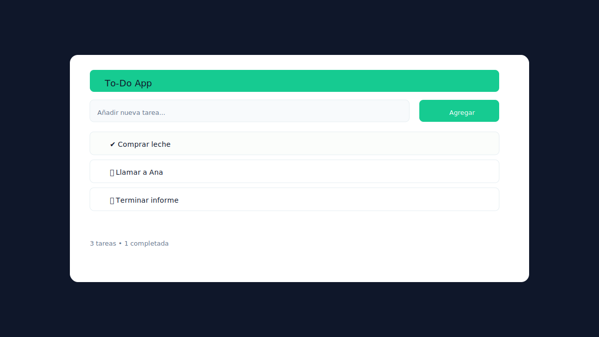
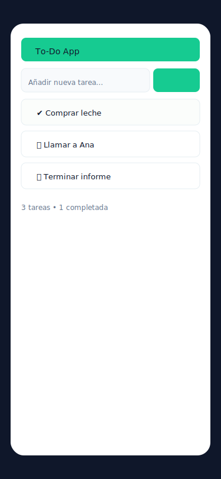

# ✅ To‑Do App — React + Vite + Tailwind + localStorage

Pequeña aplicación de lista de tareas (CRUD) creada con React y Vite, estilizada con Tailwind CSS y con persistencia local usando `localStorage`.

---

## ✨ Qué hace

- Crear, editar y eliminar tareas.
- Marcar tareas como completadas / activas.
- Filtrar por: Todas / Activas / Completadas.
- Contador de tareas pendientes.
- Persistencia automática en `localStorage`.

---

## 🚀 Inicio rápido

Requisitos: Node.js (v16+ recomendado) y npm.

En la carpeta del proyecto:

```powershell
npm install
npm run dev
```

Abre http://localhost:5173/ en tu navegador.

Para compilar para producción:

```powershell
npm run build
npm run preview   # probar la build localmente
```

Para desplegar en GitHub Pages (el proyecto usa `gh-pages`):

```powershell
npm run deploy    # ejecuta predeploy -> build y sube dist/ a gh-pages
```

---

## 📁 Estructura del proyecto

```
.
├─ index.html
├─ package.json
├─ vite.config.mjs
├─ tailwind.config.cjs
├─ postcss.config.cjs
└─ src/
   ├─ main.jsx       # entrada de la app
   ├─ App.jsx        # componente principal
   └─ index.css      # directivas Tailwind
```

---

## 🛠️ Tecnologías

- React 18
- Vite (dev server + build)
- Tailwind CSS (configurado mediante `tailwind.config.cjs`)
- PostCSS (`postcss.config.cjs`)
- gh-pages (opcional, para deploy)

---

## ⚙️ Configuración importante

- `tailwind.config.cjs` — asegúrate de que `content` incluya `./index.html` y `./src/**/*.{js,jsx}` para que Tailwind purgue clases no usadas correctamente.
- `postcss.config.cjs` — configuración mínima con `tailwindcss` y `autoprefixer`.

Si tu `type` en `package.json` está en `module` (ESM), `postcss.config.cjs` y `tailwind.config.cjs` en CommonJS funcionan correctamente.

---

## 🧭 Notas de desarrollo

- Si la página te aparece en blanco:
  1. Abre la consola de devtools (F12) y revisa errores en `Console`.
  2. Verifica que `npm run dev` está corriendo y que la URL es `http://localhost:5173/`.
  3. Fuerza recarga (`Ctrl+F5`) para evitar caché.
  4. Confirma que `src/main.jsx` monta la app en `#root`.

---

## ✅ Buenas prácticas / recomendaciones

- Mantén las configuraciones `*.cjs` si usas `type: "module"` en `package.json`.
- Añade `.prettier` / `.eslintrc` si quieres consistencia en formateo y lint.

---

## � Contribuir

Si quieres contribuir, abre un issue o envía un pull request. Para cambios rápidos: forkea, crea una rama, commitea y abre PR.

---

## 📫 Autor

Fernando Romera — contacto en el perfil de GitHub.

---

Gracias por usar / revisar el proyecto. Si quieres, puedo añadir una sección con imágenes, GIFs o una demo en línea.

---

## 🖼️ Demo / Capturas

Desktop:



Mobile:


